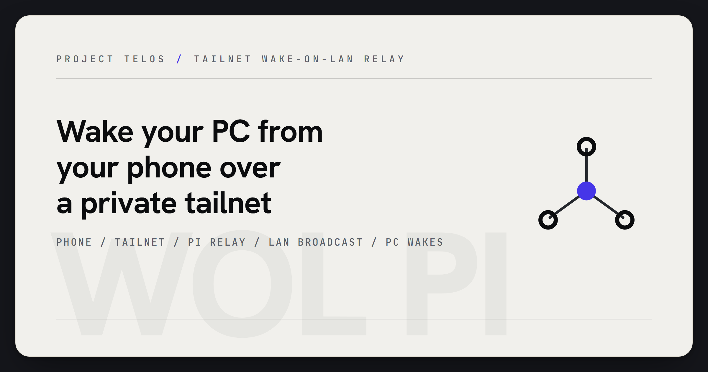

# wol-pi



> A small Raspberry Pi Wake-on-LAN relay: one mobile browser button, one tailnet hop, one magic packet to wake a Windows PC on your LAN.

[](LICENSE)


[](https://github.com/HarperZ9/wol-pi/actions/workflows/ci.yml)
[](https://harperz9.github.io)

`wol-pi` wakes a Windows PC from a phone without exposing the relay to the public internet. The usual deployment is a Raspberry Pi on the same LAN as the PC, reachable through Tailscale, serving a single mobile-first web button.

```text
phone or tablet
  -> Tailscale tailnet
  -> Raspberry Pi relay
  -> LAN broadcast magic packet
  -> Windows PC wakes
```

## Current status

This is a small, working utility with a deliberately narrow runtime:

- CPython standard library only.
- Hardened systemd unit for Raspberry Pi deployment.
- Mobile web UI plus HTTP API: `/health`, `/targets`, and `POST /wake`.
- Optional shared-token header layered on top of the private tailnet.
- Public examples use placeholders only. Do not commit real MAC addresses, tailnet hostnames, or live tokens.

## Public surface

For users, this repo provides the Pi service, the mobile wake page, a Windows one-time prep script, and deployment documentation.

The practical security model is simple: keep the relay on a private overlay network, bind it to a Pi on the same broadcast domain as the target machine, and optionally require a shared token for `POST /wake`.

## Developer surface

For maintainers, the repo is intentionally easy to inspect:

- `wol_server.py` is the whole Python relay.
- `web/` contains the static mobile UI.
- `config.example.json` documents the runtime config schema.
- `systemd/wol-pi.service` carries the Linux service hardening.
- `scripts/windows-wol-prep.ps1` handles the Windows NIC and power settings.

## Hardware

- Raspberry Pi Zero 2 W or any Pi with network access.
- MicroSD card, power supply, and network connection.
- Ethernet from the Pi to the same LAN as the PC is preferred. Wi-Fi can work when the router forwards broadcast packets correctly.

## Install on the Pi

```bash
# flash Raspberry Pi OS Lite, boot, and SSH in

curl -fsSL https://tailscale.com/install.sh | sudo bash
sudo tailscale up

git clone https://github.com/HarperZ9/wol-pi.git
cd wol-pi
sudo ./install.sh

sudo nano /etc/wol-pi/config.json
sudo systemctl restart wol-pi
```

The config is a JSON file. Leave `token` empty to disable the optional shared-token layer, or set it locally after install.

```json
{
  "token": "",
  "broadcast": "255.255.255.255",
  "targets": {
    "desktop-pc": "AA-BB-CC-DD-EE-FF"
  }
}
```

Tail the service logs:

```bash
journalctl -u wol-pi -f
```

## Prepare the Windows PC

Run once from an elevated PowerShell prompt:

```powershell
.\scripts\windows-wol-prep.ps1
```

Then enable Wake on LAN in BIOS or UEFI. Common labels include Wake on LAN, PCIe Wake-Up, or Power On by PCI-E Device.

## Use from a phone

1. Connect the phone to the same Tailscale tailnet.
2. Open `http://<pi-hostname>:8080/` or the Pi Tailscale IP.
3. Tap the wake button.
4. Wait for boot, then connect by RDP or your normal remote-desktop path.

Add the page to the phone home screen for one-tap access.

## Development

Run the local verification slice before committing:

```bash
python -m json.tool config.example.json
python -m json.tool examples/config.demo.json
python -m py_compile wol_server.py
git diff --check
```

Runtime and API details are in [USAGE.md](USAGE.md). Contribution guidelines are in [CONTRIBUTING.md](CONTRIBUTING.md).

## Security

- Keep the relay private to your tailnet or LAN.
- Do not forward the service directly to the public internet.
- Do not commit `/etc/wol-pi/config.json`, local MAC addresses, hostnames, service logs, or shared tokens.
- Prefer a long local token when multiple people can reach the tailnet relay.
- The systemd unit runs as an unprivileged user with `NoNewPrivileges`, `ProtectSystem=strict`, `ProtectHome`, and `PrivateTmp`.

## Troubleshooting

If the packet sends but the PC does not wake, check BIOS Wake on LAN, Windows Fast Startup, Ethernet link lights, NIC wake settings, and VLAN/broadcast boundaries.

The Pi must be on the same L2 broadcast domain as the target PC unless you modify the relay for unicast packets to a known IP.

## License

MIT. Copyright 2026 Zain Dana Harper.
